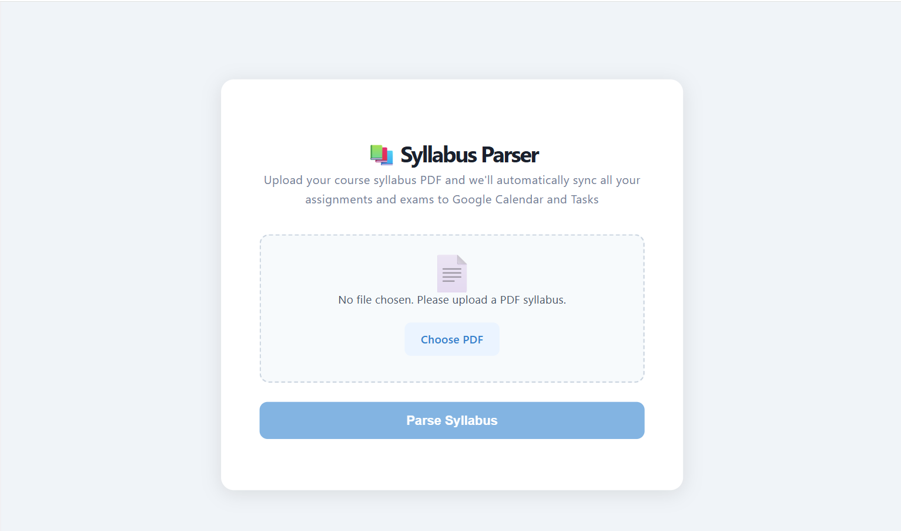

# 📚 Syllabus Parser

A full-stack web app that parses university course syllabi and automatically syncs all assignments, exams, and deadlines to Google Calendar and Google Tasks.

## Demo

Upload a syllabus PDF → review and edit parsed items → sync to Google in one click.



## Features

- **AI-powered parsing** — extracts assignments, exams, quizzes, and deadlines from any syllabus PDF using Llama 3.3 70B via Groq
- **Smart date handling** — validates dates, extracts due times (e.g. "5:00PM"), and gracefully handles edge cases like date ranges and non-date text
- **Google Calendar sync** — creates color-coded events by type (exams in red, assignments in green, etc.) with 1-day and 1-hour reminders
- **Google Tasks sync** — creates a dedicated task list per course with all assignments as checkable tasks
- **Review before syncing** — edit, delete, or add items manually before anything is sent to Google
- **OAuth 2.0 authentication** — secure Google login flow, token saved locally so users only authenticate once

## Tech Stack

| Layer | Technology |
|---|---|
| Frontend | React, Vite, Axios |
| Backend | Python, Flask, Flask-CORS |
| PDF Extraction | Docling |
| AI Parsing | Groq API (Llama 3.3 70B) |
| Google Integration | Google Calendar API, Google Tasks API |
| Auth | OAuth 2.0 |

## Getting Started

### Prerequisites
- Python 3.11+
- Node.js 18+
- A [Groq API key](https://console.groq.com) (free)
- A [Google Cloud project](https://console.cloud.google.com) with Calendar and Tasks APIs enabled

### Installation

**1. Clone the repo:**
```bash
git clone https://github.com/Rami-j5/syllabus-parser.git
cd syllabus-parser
```

**2. Set up the backend virtual environment:**
```bash
cd backend
python -m venv .venv
```
Then activate it:
- Windows: `.venv\Scripts\activate`
- Mac/Linux: `source .venv/bin/activate`
```bash
pip install -r requirements.txt
```

**3. Set up environment variables:**

Create a `.env` file in the root `syllabus-parser/` folder:
```
GROQ_API_KEY=your_groq_api_key_here
```

**4. Add Google credentials:**

- Go to [Google Cloud Console](https://console.cloud.google.com)
- Enable the Google Calendar API and Google Tasks API
- Create an OAuth 2.0 Client ID (Desktop App)
- Download the credentials JSON and save it as `backend/credentials.json`

**5. Set up the frontend:**
```bash
cd frontend
npm install
```

### Running the App

You need two terminals open simultaneously:

**Terminal 1 — Backend:**
```bash
cd backend
.venv\Scripts\activate
python app.py
```

**Terminal 2 — Frontend:**
```bash
cd frontend
npm run dev
```

Then open [http://localhost:5173](http://localhost:5173) in your browser.

On first use, clicking "Sync to Google" will open a browser tab for Google OAuth login. After authenticating once, your token is saved locally and future syncs happen instantly.

> **Note:** Calendar events and Tasks are currently created in the `America/Toronto` timezone. To change this, update the `timeZone` field in `backend/google_sync.py`.

## Project Structure
```
syllabus-parser/
├── backend/
│   ├── app.py           # Flask server — API routes
│   ├── parser.py        # Docling + Groq — PDF extraction and AI parsing
│   └── google_sync.py   # Google Calendar and Tasks integration
├── frontend/
│   └── src/
│       ├── App.jsx
│       └── components/
│           ├── UploadPage.jsx
│           ├── ReviewPage.jsx
│           └── SuccessPage.jsx
└── .env                 # API keys (not committed)
```

## How It Works

1. User uploads a syllabus PDF
2. Docling extracts the raw text, preserving tables and headers
3. Groq (Llama 3.3 70B) interprets the text and returns structured JSON with all assignments, dates, weights, and types
4. User reviews and edits the parsed items on the Review page
5. Flask calls the Google APIs to create Calendar events and Tasks
6. User sees a summary of everything that was synced

## Future Improvements

- Caching to avoid re-parsing identical PDFs
- Support for multiple syllabi in one session
- Drag-and-drop PDF upload
- Timezone selection in the UI